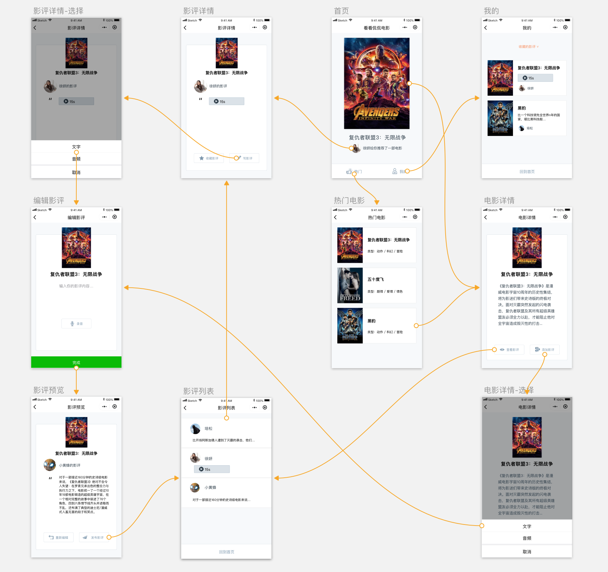
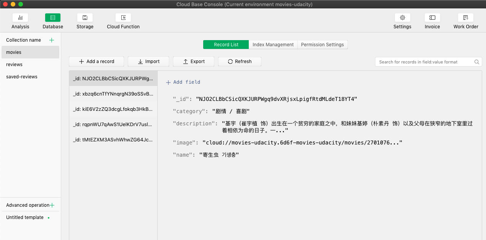
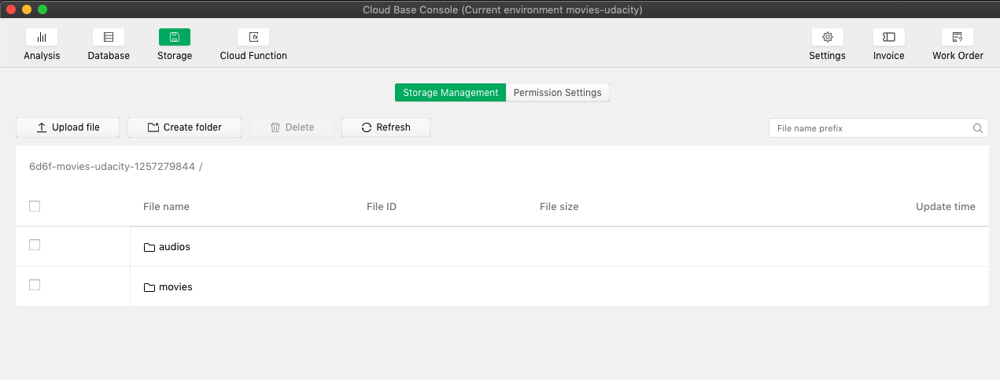

# 项目说明

你将独立设计、开发一款集查询、点评、收藏功能于一体的电影小程序应用。你可以用来查看热门电影和影片详情，发布自己的影评，用户也可以收藏他人影评。你将掌握小程序社交属性功能开发的能力，成为连接社交和应用场景的优秀小程序开发人才。

__应用至少拥有以下页面：__
- 首页：随机展示当前热门电影的某一条影评。
- 电影列表页：展示当前最热门的若干部电影（至少5部）。
- 电影详情页：展示电影详情信息。
- 影评列表页：展示某电影的影评列表。
- 影评详情页：展示某条具体的影评内容。
- 影评编辑页：用户能在此页面编辑自己的影评内容。
- 影评预览页：预览已编辑完成的影评。
- 个人中心页：展示用户已收藏和已发布的影评列表。
- 交互图如下

---

## Setup

### Database

须在后台建立`movies`, `reviews`和`saved-reviews`三个数据库，使用`resources/db`目录下的JSON文件分别初始化数据库。

### Storage

须在后台建立`audios`, `movies`两个buckets。注意`movies` bucket中图片的路径应与`movies`数据库中图片的路径保持一致（图片可在`resources/storage`中找到）。

### Cloud Environment

修改 Environment ID：app.js, cloudfunctions/function/index.js